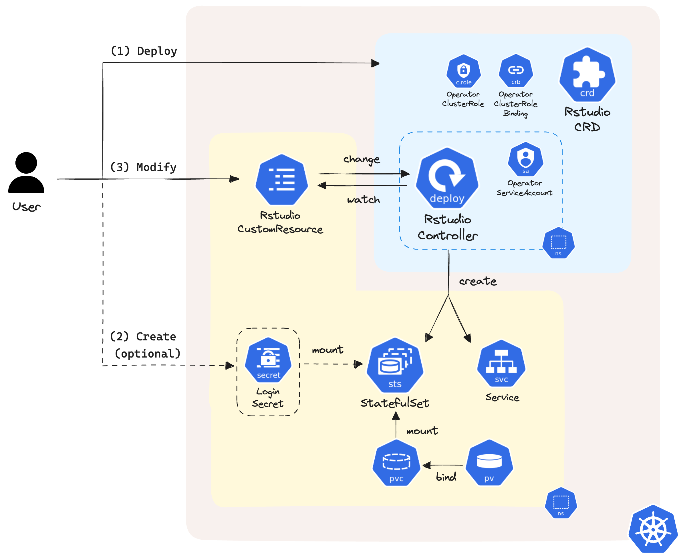

# Rstudio Operator

## Overview
RStudio IDE is an integrated development environment for R widely used by data scientists. The RStudio Operator aims to make running an RStudio on Kubernetes easier by using Kubernetes custom resources.



## Installation
Clone the repository and install with [Kustomize](https://kustomize.io/).
```
cd rstudio-operator
kustomize build manifests/base | kubectl apply -f -
```

## Rstudio Custom Resource
<table>
  <thead>
    <tr>
      <th>Field</th>
      <th>Description</th>
    </tr>
  </thead>
  <tbody>
    <tr>
      <td><code>apiVersion</code><br/><em>string (Required.)</em></td>
      <td><code>emmaliaocode.dev/v1</code></td>
    </tr>
    <tr>
      <td><code>kind</code><br/><em>string (Required.)</em></td>
      <td><code>Rstudio</code></td>
    </tr>
    <tr>
      <td><code>metadata</code><br/><em>object (Required.)</em></td>
      <td>Standard object's metadata.</td>
    </tr>
    <tr>
      <td><code>spec</code><br/><em>object (Required.)</em></td>
      <td>
        <table>
          <p>Specification of the Rstudio instance.</p>
          <thead>
            <tr>
              <th>Subfield</th>
              <th>Description</th>
            </tr>
          </thead>
          <tbody>
            <tr>
              <td><code>image</code><br/><em>string (Required.)</em></td>
              <td>Image digest from <a herf="https://hub.dockercom/r/rocker/ rstudio/tags">Docker Hub (rocker/rstudio)</a>. Must start with the prefix rocker/rstudio and separate the R version with <code>:</code>. For example, <code>rocker/rstudio:4.4.0</code> creates an Rstudio of R version 4.4.0.</td>
            </tr>
            <tr>
              <td><code>imagePullPolicy</code><br/><em>string</em></td>
              <td>Image pull policy. One of <code>Always</code>, <code>Never</code>, <code>IfNotPresent</code>. Defaults to <code>Always</code> if the 'latest' tag is specified in <code>image</code>, or <code>IfNotPresent</code> otherwise.</td>
            </tr>
            <tr>
              <td><code>loginSecret</code><br/><em>string</em></td>
              <td>Set the password for logining to Rstudio with a Secret, the secret must contain a <code>password</code> key. Default password will be printed in the container log if this is not set.</td>
            </tr>
            <tr>
              <td><code>isRoot</code><br/><em>boolean</em></td>
              <td>Whether the Linux system user should be added to the sudoers group during the Rstudio server init process. Default is <code>false</code>.</td>
            </tr>
            <tr>
              <td><code>resources</code><br/><em>string</em></td>
              <td>
                <table>
                  <p>Compute Resources required by this Rstudio instance.</p>
                  <thead>
                    <tr>
                      <th>Subfield</th>
                      <th>Description</th>
                    </tr>
                  </thead>
                  <tbody>
                    <tr>
                      <td><code>requests</code><br/><em>string</em></td>
                      <td>Requests describes the minimum amount of compute resources required.</td>
                    </tr>
                    <tr>
                      <td><code>limits</code><br/><em>string</em></td>
                      <td>Limits describes the maximum amount of compute resources allowed.</td>
                    </tr>
                  </tbody>
                </table>
              </td>
            </tr>
            <tr>
              <td><code>storages</code><br/><em>array</em></td>
              <td>
                <table>
                  <p>Storages are a list of claims that an Rstudio instance is allowed to reference.</p>
                  <thead>
                    <tr>
                      <th>Subfield</th>
                      <th>Description</th>
                    </tr>
                  </thead>
                  <tbody>
                    <tr>
                      <td><code>name</code><br/><em>string (Required.)</em></td>
                      <td>Name of the claim.</td>
                    </tr>
                    <tr>
                      <td><code>storageSize</code><br/><em>string (Required.)</em></td>
                      <td>StorageSize represents the minimum resources the volume should have.</td>
                    </tr>
                    <tr>
                      <td><code>accessModes</code><br/><em>array (Required.)</em></td>
                      <td>AccessModes contains the desired access modes the volume should have. Could be <code>ReadWriteOnce</code>, <code>ReadOnlyMany</code>, <code>ReadWriteMany</code>.</td>
                    </tr>
                    <tr>
                      <td><code>storageClassName</code><br/><em>string</em></td>
                      <td>Name of the StorageClass required by the claim.</td>
                    </tr>
                  </tbody>
                </table>
              </td>
            </tr>
            <tr>
              <td><code>volumes</code><br/><em>array</em></td>
              <td>
                <table>
                  <p>Volumes that can be mounted to the Rstudio instance.</p>
                  <thead>
                    <tr>
                      <th>Subfield</th>
                      <th>Description</th>
                    </tr>
                  </thead>
                  <tbody>
                    <tr>
                      <td><code>name</code><br/><em>string (Required.)</em></td>
                      <td>Name of the volume must be unique.</td>
                    </tr>
                    <tr>
                      <td><code>configMap</code><br/><em>object</em></td>
                      <td>Mount a ConfigMap that already existed in the same namespace.</td>
                    </tr>
                    <tr>
                      <td><code>persistentVolumeClaim</code><br/><em>object</em></td>
                      <td>Mount a PersistentVolumeClaim that already existed in the same namespace.</td>
                    </tr>
                    <tr>
                      <td><code>secret</code><br/><em>object</em></td>
                      <td>Mount a Secret that already existed in the same namespace.</td>
                    </tr>
                    <tr>
                      <td><code>emptyDir</code><br/><em>object</em></td>
                      <td>Mount a temporary directory that can be used by multiple containers in the same pod.</td>
                    </tr>
                  </tbody>
                </table>
              </td>
            </tr>
            <tr>
              <td><code>volumeMounts</code><br/><em>array</em></td>
              <td>
                <table>
                  <p>Volumes to mount into the container's filesystem.</p>
                  <thead>
                    <tr>
                      <th>Subfield</th>
                      <th>Description</th>
                    </tr>
                  </thead>
                  <tbody>
                    <tr>
                      <td><code>name</code><br/><em>string (Required.)</em></td>
                      <td>This must match the Name of a Volume.</td>
                    </tr>
                    <tr>
                      <td><code>mountPath</code><br/><em>string (Required.)</em></td>
                      <td>Path within the container at which the volume should be mounted.</td>
                    </tr>
                  </tbody>
                </table>
              </td>
            </tr>
          </tbody>
        </table>
      </td>
    </tr>
    <tr>
      <td>
        <code>status</code> <br/> <em>object</em>
      </td>
      <td>Most recently observed status of the Rstudio.</td>
    </tr>
  </tbody>
</table>

## Usage
Create a password secret for logging in to Rstudio IDE.
```bash
kubectl create secret generic rstudio-secret --from-literal=password=[password]
```
Create a Rstudio custom resource.
```bash
kubectl apply -f - <<EOF
apiVersion: emmaliaocode.dev/v1
kind: Rstudio
metadata:
  name: example
  namespace: default
spec:
  image: rocker/rstudio:4.4.0
  imagePullPolicy: IfNotPresent
  loginSecret: rstudio-secret
  isRoot: true
  resources:
    requests:
      cpu: "250m"
      memory: "64Mi"
    limits:
      cpu: "500m"
      memory: "128Mi"
  storages:
  - name: my-storage
    storageClassName: standard
    storageSize: "1Gi"
    accessModes:
    - ReadWriteMany
  volumes:
  - name: my-config
    configMap:
      name: my-config
  - name: my-pvc
    persistentVolumeClaim:
      claimName: my-pvc
  - name: my-secret
    secret:
      secretName: my-secret
  - name: my-empty-dir
    emptyDir:
      sizeLimit: "1Gi"
  volumeMounts:
  - name: my-storage
    mountPath: /storage
  - name: my-config
    mountPath: /config
  - name: my-pvc
    mountPath: /pvc
  - name: my-secret
    mountPath: /secret
  - name: my-empty-dir
    mountPath: /empty-dir
EOF
```
```bash
rstudio.emmaliaocode.dev/example created
```
Get objects with `rstudio=example` label.
```bash
kubectl get all -l rstudio=example
```
```bash
NAME                    READY   STATUS    RESTARTS   AGE
pod/example-rstudio-0   1/1     Running   0          4m13s

NAME                      TYPE       CLUSTER-IP     EXTERNAL-IP   PORT(S)          AGE
service/example-rstudio   NodePort   10.109.56.60   <none>        8787:32378/TCP   4m13s

NAME                               READY   AGE
statefulset.apps/example-rstudio   1/1     4m13s
```
